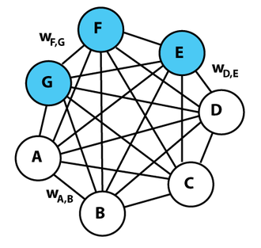

---
output:
  pdf_document: default
  author: Naveen Mathew Nathan S.
---

# Boltzmann machine

Can be considered as a computational neuroscience dream. Can a network learn by itself?

Boltzmann machine is fully connected: all visible and hidden units connected to each other. This implies there is no structure imposed on the network. Analogous to the human nervous system where the sensory neurons are the visible units and other neurons are hidden units. Equilibrium state is attained by minimizing the energy:

$$E = -\big(\sum_{i<j}w_{ij}s_is_j + \sum_{i}b_is_i\big)$$

Boltzmann machines are very difficult to train in practice.

# Restricted Boltzmann machine

Connections are restricted between visible and hidden units. Visible-visible and hidden-hidden connections are absent.

$$E(v, h) = -\big(\sum_{i=1}^{D}\sum_{j=1}^{M}w_{ij}v_ih_j + \sum_{i=1}^{D}b_iv_i + \sum_{j=1}^{M}c_jh_j\big) = -(v^Twh + b^Tv + c^Th)$$

$$p(v,h) \propto e^{-E(v,h)}$$

$$p(v,h) = \frac{1}{Z}e^{-E(v,h)}, Z = \sum_v\sum_he^{-E(v,h)}; \sum_v\sum_hp(v,h)=1$$

Z is the partition function.

This comes from $p_i \propto e^{-E_i/(kT)}; p_i = \frac{1}{Z} e^{-E_i/(kT)}; Z = \sum_ie^{-E_i/(kT)}$

## Intractability

Calculating the sum for all possible states is computationally expensive.

If v has length D and h has length M, there are $2^D \times 2^M = 2^{D+M}$ possibilities. MNIST example: D = 784, M = 100.

## Training

For simplicity let us assume that both visible and hidden units are binary encoded. Eg: $v_i = \begin{cases}0&x_i/255\le0.5\\1&x_i/255>0.5\end{cases}$

### Probabilities

$$p(v|h) = p(v,h)/p(h);p(h|v) = p(v,h)/p(v)$$

**Marginals** $p(v) = \sum_hp(v,h); p(h) = \sum_vp(v,h)$

$$p(v,h) = \frac{1}{Z}exp(v^Twh+b^Tv+c^th)$$

$$p(v) = \sum_h\frac{1}{Z}exp(v^Twh+b^Tv+c^th)$$

$$\implies p(h|v) = \frac{exp(v^Twh+b^Tv+c^th)}{\sum_h\exp(v^Twh+b^Tv+c^th)} = \frac{1}{Z'}exp(v^Twh+b^Tv+c^th)$$

Sum over h makes this intractable.

$$\implies p(h|v) = \frac{1}{Z'}exp(\sum_{i=1}^{D}\sum_{j=1}^{M}w_{ij}v_ih_j + \sum_{i=1}^{D}b_iv_i + \sum_{j=1}^Dc_jh_j)$$
$$= \frac{1}{Z'}exp(\sum_{i=1}^{D}b_iv_i)\prod_{j=1}^Mexp(\sum_{i=1}^Dw_{ij}v_ih_j+c_jh_j) = \frac{1}{Z''}\prod_{j=1}^Mexp(\sum_{i=1}^Dw_{ij}v_ih_j+c_jh_j)$$

The last step was possible because v is conditioned on.

$$\implies p(h|v) = \frac{1}{Z''}\prod_{j=1}^Mexp(\sum_{i=1}^Dh_j\{w_{ij}v_i+c_j\})$$

Hidden units are independent $p(h_j|v) = \frac{1}{Z'''}exp(h_j\sum_{i=1}^D\{w_{ij}v_i+c_j\})$ because they are not connected to each other.

Since $h_j$ is binary, $p(h_j=1|v) = \frac{1}{Z'''}exp(\sum_{i=1}^D\{w_{ij}v_i+c_j\}), p(h_j=0|v)=\frac{1}{Z'''} \implies Z'''= 1 + exp(\sum_{i=1}^D\{w_{ij}v_i+c_j\}); p(h_j=1|v) = sigmoid(\sum_{i=1}^Dw_{ij}v_i+c_j) = sigmoid(w^Tv + c)$. This gives a vector of probabilities. Similar derivation can be used for $p(v=1|h)$